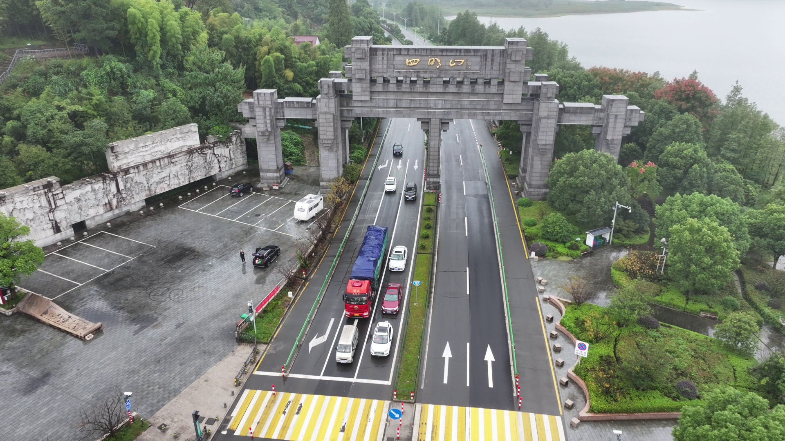
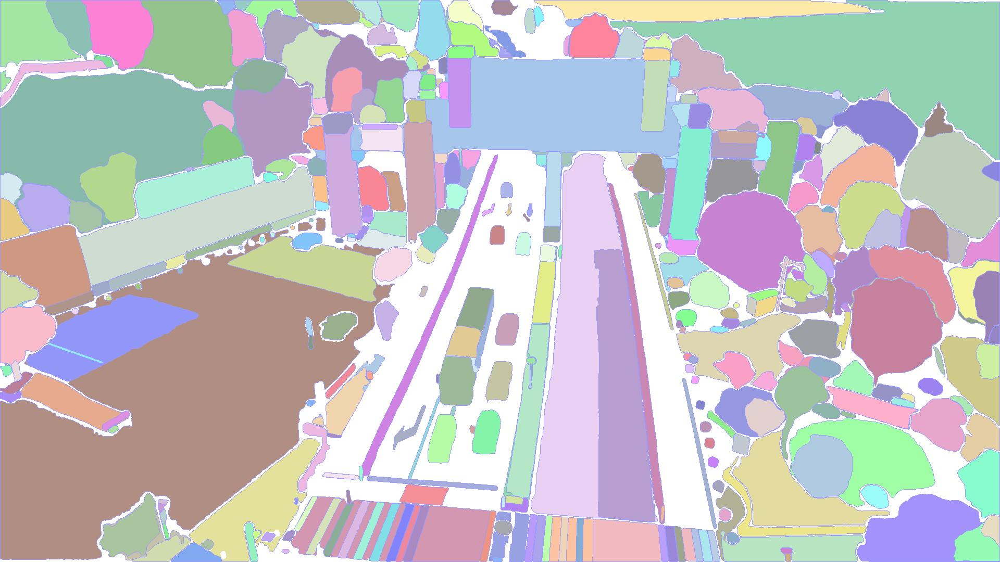
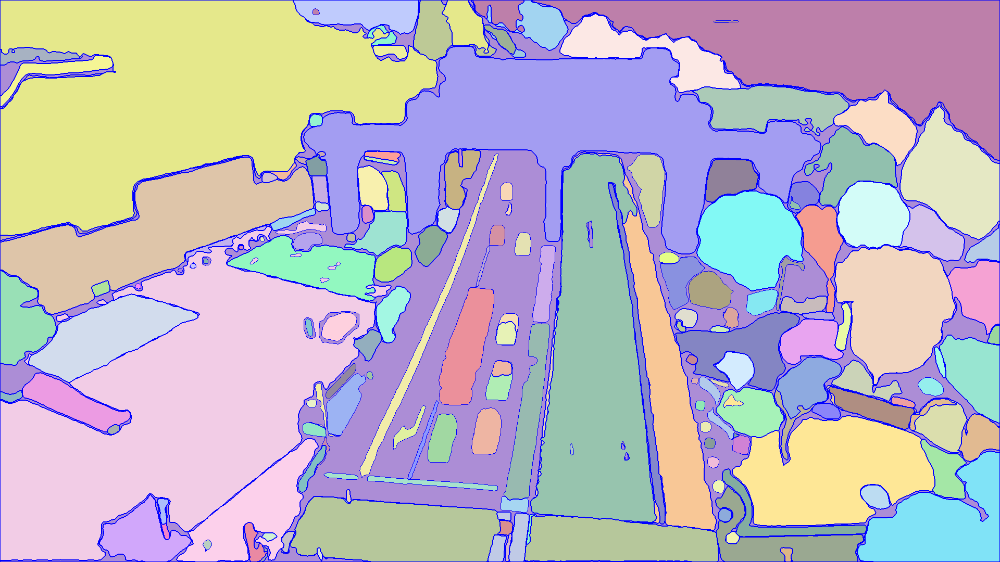

<p align="center">
  <h1 align="center">DroneSplat: 3D Gaussian Splatting for Robust 3D Reconstruction from In-the-Wild Drone Imagery</h1>
<p align="center">

<p align="center">
  <a href="https://arxiv.org/abs/2503.16964">Paper</a> |
  <a href="https://bityia.github.io/DroneSplat/">Project page</a> | 
  <a href="https://drive.google.com/drive/folders/1DWm-foUQC2QBsrr3QC6Tx8bDmWTfgAzu?usp=sharing">Dataset</a> 
</p>


## Get Started

### Installation
1. Clone DroneSplat and download pre-trained model.
```bash
git clone --recursive https://github.com/BITyia/DroneSplat.git
cd DroneSplat
git submodule update --init --recursive
mkdir -p checkpoints/
wget https://download.europe.naverlabs.com/ComputerVision/DUSt3R/DUSt3R_ViTLarge_BaseDecoder_512_dpt.pth -P checkpoints/
wget https://dl.fbaipublicfiles.com/segment_anything_2/072824/sam2_hiera_large.pt -P checkpoints/
```

2. Create the environment.
```bash
conda create -n dronesplat python=3.11
conda activate dronesplat
pip install torch==2.4.0 torchvision==0.19.0 torchaudio==2.4.0 --index-url https://download.pytorch.org/whl/cu121
pip install -r requirements.txt
pip install submodules/simple-knn
pip install submodules/diff-gaussian-rasterization
```

3. Build SAM2 Model
```bash
cd submodules/sam2
pip install -e .
cd ..
```

4. Optional (if you want to use DUSt3R).
```bash
# DUST3R relies on RoPE positional embeddings for which you can compile some cuda kernels for faster runtime.
cd submodules/dust3r/croco/models/curope/
python setup.py build_ext --inplace
```

### Data preparation
We provide two scenes of [DroneSplat dataset](https://drive.google.com/drive/folders/1DWm-foUQC2QBsrr3QC6Tx8bDmWTfgAzu?usp=sharing) for evaluation.

In addition, we also conduct experiments on [NeRF On-the-go](https://github.com/cvg/nerf-on-the-go) and [UrbanScene3D](https://vcc.tech/UrbanScene3D).

## Usage
### 2D Segmentation
```
python seg_all_instances.py --image_dir data/Simingshan
```
You can try adjusting different parameters in the SAM2AutomaticMaskGenerator to achieve better segmentation results. Here are the segmentation results of the image named "2411006_18_002.jpg" using different parameters.

<div style="display:flex; justify-content:center;">
  
  
  
</div>

### Training
Run the following command to train on Simingshan. 
```
python train.py -s data/Simingshan -m output/Simingshan --scene Simingshan --iter 7000 --use_masks
```
### Rendering
Run the following script to render train and  test images:
```
python render.py -s data/Simingshan -m output/Simingshan --iter 7000
```
Run the following script to render a video:
```
python render_video.py -s data/Simingshan -m output/Simingshan --iter 7000 --n_views 600 --fps 30
```

### Evaluation
```
python metrics.py --rendering output/Simingshan/render_test --gt data/Simingshan/images --output output/Simingshan/metrics.json
```

## Shoutouts and Credits
This project is built on top of open-source code. We thank the open-source research community and credit our use of parts of [3D Guassian Splatting](https://github.com/graphdeco-inria/gaussian-splatting), [DUSt3R](https://github.com/naver/dust3r), and [InstantSplat](https://github.com/NVlabs/InstantSplat). 
